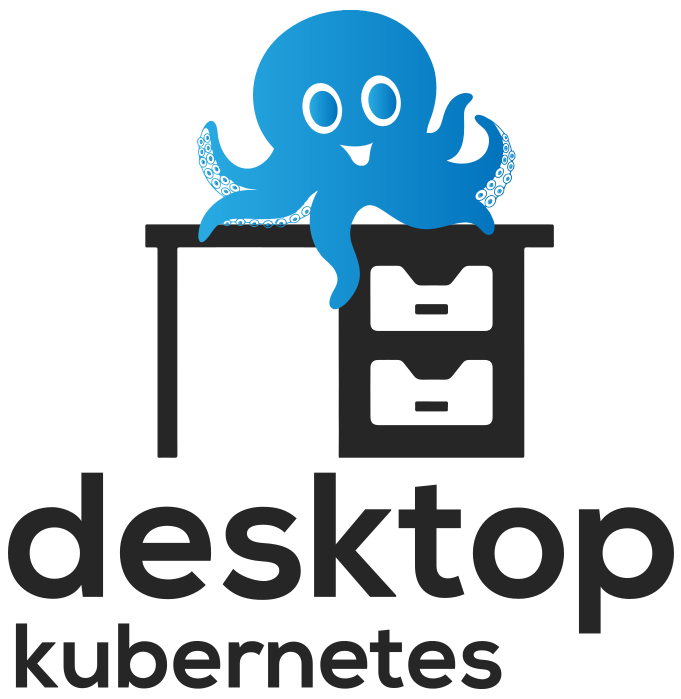
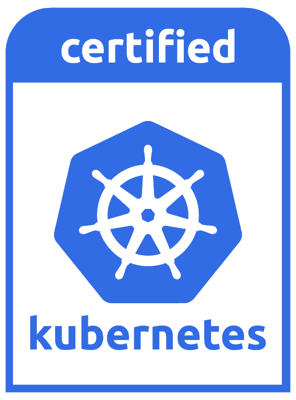

# Introduction

_Desktop Kubernetes_ is a Linux *Bash* CLI that provisions a desktop Kubernetes cluster using KVM or VirtualBox - with each cluster node consisting of a guest VM on your desktop running Alma, CentOS, or Rocky Linux.

There are many fine and innovative Kubernetes distros. This distro has just a few goals:

1. Create a cluster consisting of VMs. Since many of us troubleshoot Kubernetes running in VMs, this seems natural.
1. Create and run the cluster on the desktop workstation rather that requiring to buy additional hardware or rent virtualized infrastructure.
1. Use pure upstream binaries without any additional packaging or alteration.
1. Create a cluster provisioning process that is simple and repeatable.

The goal of this distro is to create stable, reliable, production-grade VM-based development clusters to support at-home or localized desktop development of Kubernetes workloads, and experimentation with CNCF Kubernetes workloads.

{ width=110px align=left }

_Desktop Kubernetes_ is the *57 Chevy* of Kubernetes distros: you can take it apart and put it back together with just a few Linux console tools: `bash`, `curl`, `ssh`, `scp`, `tar`, `openssl`, `helm`, `yq`, kvm tools (`virsh`, `virt-install`, `qemu-img`), and `kubectl`. That being said, **v1.33.1** of this distribution is Kubernetes Certified. See: [CNCF Landscape](https://landscape.cncf.io/?group=certified-partners-and-providers&view-mode=grid&item=platform--certified-kubernetes-distribution--desktop-kubernetes).

The project consists of a number of bash scripts and supporting manifests / config files. The design is documented in the [Design](design.md) Section.

This project started as a way to automate the steps in **Kelsey Hightower's** [Kubernetes The Hard Way](https://github.com/kelseyhightower/kubernetes-the-hard-way) - just to see if I could. But over time it matured and, at this point I rely on it for all my local Kubernetes development. I use it on Ubuntu 24+ systems with 64 gigs of RAM and 6+ hyper-threaded processors. I can run a three-node cluster with each VM having 2-3 CPUs and 8+ gigs of RAM.

_Desktop Kubernetes_ can provision clusters with one, two, three, or more nodes. The only limits are the memory and CPU of your desktop computer.
